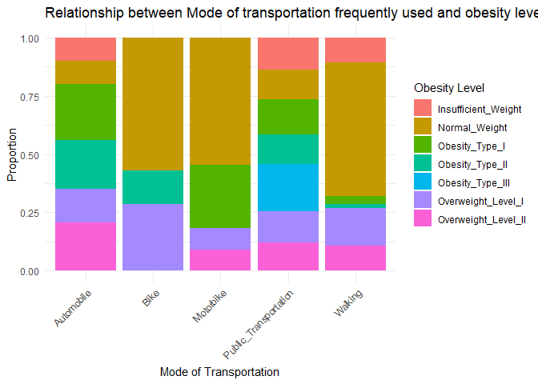
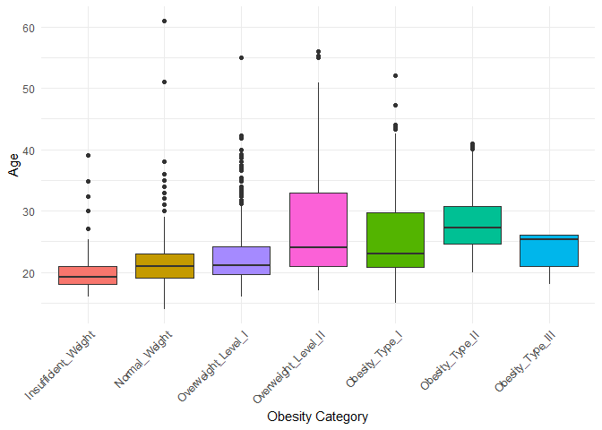

Obesity_classification
================
Farah Salahuddin

## Dataset Description and Exploratory Analysis

The dataset obtained from UC Irvine Machine Learning Repository is
called ‘Estimation of Obesity Levels Based on Eating Habits and Physical
Condition’. The dataset consists of 2111 unique observations and 17
attributes that are as follows: Gender, Age, Height, Weight, Family
History, if the person eats high caloric food frequently, if the person
eats vegetables in meals, number of meals in a day, if the individual
eats between meals, smoking, amount of water intake, frequency of
physical activity, time on technological devices, frequency of alcohol
intake and mode of transportation. Out of these, some are numeric
variables for example age, weight and height, while others are
categorical variables such as gender, smoking and transportation.

The relationship between the predictor variables and the response
variable, obesity level was studied.

``` r
library(ggcorrplot)
```

    ## Warning: package 'ggcorrplot' was built under R version 4.2.3

    ## Loading required package: ggplot2

    ## Warning: package 'ggplot2' was built under R version 4.2.3

``` r
library(ggplot2)
library(gridExtra)
```

    ## Warning: package 'gridExtra' was built under R version 4.2.3

``` r
library(pls)
```

    ## 
    ## Attaching package: 'pls'

    ## The following object is masked from 'package:stats':
    ## 
    ##     loadings

``` r
library(glmnet)
```

    ## Warning: package 'glmnet' was built under R version 4.2.3

    ## Loading required package: Matrix

    ## Warning: package 'Matrix' was built under R version 4.2.3

    ## Loaded glmnet 4.1-7

``` r
library(MASS)
```

    ## Warning: package 'MASS' was built under R version 4.2.3

``` r
library(leaps)
library(dplyr)
```

    ## Warning: package 'dplyr' was built under R version 4.2.3

    ## 
    ## Attaching package: 'dplyr'

    ## The following object is masked from 'package:MASS':
    ## 
    ##     select

    ## The following object is masked from 'package:gridExtra':
    ## 
    ##     combine

    ## The following objects are masked from 'package:stats':
    ## 
    ##     filter, lag

    ## The following objects are masked from 'package:base':
    ## 
    ##     intersect, setdiff, setequal, union

``` r
library(tidyr)
```

    ## Warning: package 'tidyr' was built under R version 4.2.3

    ## 
    ## Attaching package: 'tidyr'

    ## The following objects are masked from 'package:Matrix':
    ## 
    ##     expand, pack, unpack

``` r
library(readxl)
```

    ## Warning: package 'readxl' was built under R version 4.2.3

``` r
library(rpart)
library(randomForest)
```

    ## randomForest 4.7-1.1

    ## Type rfNews() to see new features/changes/bug fixes.

    ## 
    ## Attaching package: 'randomForest'

    ## The following object is masked from 'package:dplyr':
    ## 
    ##     combine

    ## The following object is masked from 'package:gridExtra':
    ## 
    ##     combine

    ## The following object is masked from 'package:ggplot2':
    ## 
    ##     margin

``` r
library(caret)
```

    ## Loading required package: lattice

    ## Warning: package 'lattice' was built under R version 4.2.3

    ## 
    ## Attaching package: 'caret'

    ## The following object is masked from 'package:pls':
    ## 
    ##     R2

``` r
library(gbm)
```

    ## Loaded gbm 2.2.2

    ## This version of gbm is no longer under development. Consider transitioning to gbm3, https://github.com/gbm-developers/gbm3

``` r
library(adabag)
```

    ## Warning: package 'adabag' was built under R version 4.2.3

    ## Loading required package: foreach

    ## Loading required package: doParallel

    ## Warning: package 'doParallel' was built under R version 4.2.3

    ## Loading required package: iterators

    ## Loading required package: parallel

``` r
url <- "https://archive.ics.uci.edu/static/public/544/estimation+of+obesity+levels+based+on+eating+habits+and+physical+condition.zip"
temp_zip <- tempfile(fileext = ".zip")
download.file(url, temp_zip, mode = "wb")
```

``` r
unzip_dir <- tempdir()
unzip(temp_zip, exdir = unzip_dir)
```

``` r
list.files(unzip_dir)
```

    ## [1] "file64742255f1a"                          
    ## [2] "file64745b3c88c"                          
    ## [3] "file647470145aa6"                         
    ## [4] "file647472183e04.zip"                     
    ## [5] "file647475a041ae"                         
    ## [6] "file6474b6b39c6"                          
    ## [7] "ObesityDataSet_raw_and_data_sinthetic.csv"
    ## [8] "rgl64742b20436"

``` r
file_path <- file.path(unzip_dir, "ObesityDataSet_raw_and_data_sinthetic.csv")
obesity <- read.table(file_path,sep=",",header=TRUE)
```

``` r
head(obesity)
```

    ##   Gender Age Height Weight family_history_with_overweight FAVC FCVC NCP
    ## 1 Female  21   1.62   64.0                            yes   no    2   3
    ## 2 Female  21   1.52   56.0                            yes   no    3   3
    ## 3   Male  23   1.80   77.0                            yes   no    2   3
    ## 4   Male  27   1.80   87.0                             no   no    3   3
    ## 5   Male  22   1.78   89.8                             no   no    2   1
    ## 6   Male  29   1.62   53.0                             no  yes    2   3
    ##        CAEC SMOKE CH2O SCC FAF TUE       CALC                MTRANS
    ## 1 Sometimes    no    2  no   0   1         no Public_Transportation
    ## 2 Sometimes   yes    3 yes   3   0  Sometimes Public_Transportation
    ## 3 Sometimes    no    2  no   2   1 Frequently Public_Transportation
    ## 4 Sometimes    no    2  no   2   0 Frequently               Walking
    ## 5 Sometimes    no    2  no   0   0  Sometimes Public_Transportation
    ## 6 Sometimes    no    2  no   0   0  Sometimes            Automobile
    ##            NObeyesdad
    ## 1       Normal_Weight
    ## 2       Normal_Weight
    ## 3       Normal_Weight
    ## 4  Overweight_Level_I
    ## 5 Overweight_Level_II
    ## 6       Normal_Weight

``` r
obesity$Gender=factor(obesity$Gender)
obesity$family_history_with_overweight=factor(obesity$family_history_with_overweight)
obesity$FAVC=factor(obesity$FAVC) #high caloric food
obesity$FCVC=factor(obesity$FCVC) #vegetables
obesity$FCVC=round(as.numeric(levels(obesity$FCVC)[obesity$FCVC]))
obesity$FCVC=factor(obesity$FCVC) #vegetables

obesity$FAF=factor(obesity$FAF) #physical activity
obesity$FAF=round(as.numeric(levels(obesity$FAF)[obesity$FAF]))
obesity$FAF=factor(obesity$FAF) #physical activity


obesity$CAEC=factor(obesity$CAEC) #eat any food between meals
obesity$SMOKE=factor(obesity$SMOKE)
obesity$SCC=factor(obesity$SCC) #monitor calories you eat
obesity$CALC=factor(obesity$CALC) #alcohol
obesity$MTRANS=factor(obesity$MTRANS) #transportation
obesity$NObeyesdad=factor(obesity$NObeyesdad)
```

``` r
names_ob=c("Insufficient_Weight", "Normal_Weight", "Overweight_Level_I", "Overweight_Level_II","Obesity_Type_I","Obesity_Type_II","Obesity_Type_III")
ggplot(obesity,aes(x = factor(NObeyesdad, levels = c("Insufficient_Weight", "Normal_Weight", "Overweight_Level_I", "Overweight_Level_II","Obesity_Type_I","Obesity_Type_II","Obesity_Type_III")) 
                   ,fill=NObeyesdad
                    )) + geom_bar(fill="lightblue") + 
  theme(legend.position="none",axis.text.x = element_text(angle =45, hjust = 1)) +
  labs(fill='Nobeyesdad',title = "Counts of different levels of obesity in data", x = "Obesity Category", y = "Frequency")
```

<!-- -->

``` r
colnames_predictors=c("Gender","family_history_with_overweight","FAVC","FCVC","CAEC","SMOKE","SCC","CALC","MTRANS")
colnames_pred_num=c("Age","Height","Weight","NCP")

data_long <- obesity %>%
  pivot_longer(cols = colnames_pred_num, names_to = "Variable", values_to = "Value")
```

    ## Warning: Using an external vector in selections was deprecated in tidyselect 1.1.0.
    ## ℹ Please use `all_of()` or `any_of()` instead.
    ##   # Was:
    ##   data %>% select(colnames_pred_num)
    ## 
    ##   # Now:
    ##   data %>% select(all_of(colnames_pred_num))
    ## 
    ## See <https://tidyselect.r-lib.org/reference/faq-external-vector.html>.
    ## This warning is displayed once every 8 hours.
    ## Call `lifecycle::last_lifecycle_warnings()` to see where this warning was
    ## generated.

``` r
head(data_long)
```

    ## # A tibble: 6 × 15
    ##   Gender family_history_with_o…¹ FAVC  FCVC  CAEC  SMOKE  CH2O SCC   FAF     TUE
    ##   <fct>  <fct>                   <fct> <fct> <fct> <fct> <dbl> <fct> <fct> <dbl>
    ## 1 Female yes                     no    2     Some… no        2 no    0         1
    ## 2 Female yes                     no    2     Some… no        2 no    0         1
    ## 3 Female yes                     no    2     Some… no        2 no    0         1
    ## 4 Female yes                     no    2     Some… no        2 no    0         1
    ## 5 Female yes                     no    3     Some… yes       3 yes   3         0
    ## 6 Female yes                     no    3     Some… yes       3 yes   3         0
    ## # ℹ abbreviated name: ¹​family_history_with_overweight
    ## # ℹ 5 more variables: CALC <fct>, MTRANS <fct>, NObeyesdad <fct>,
    ## #   Variable <chr>, Value <dbl>

``` r
ggplot(obesity, aes(x = factor(NObeyesdad, levels = c("Insufficient_Weight", "Normal_Weight", "Overweight_Level_I", "Overweight_Level_II","Obesity_Type_I","Obesity_Type_II","Obesity_Type_III")), y = Age, fill = NObeyesdad)) +
  geom_boxplot() +
  theme_minimal() +
  theme(legend.position="none",axis.text.x = element_text(angle =45, hjust = 1)) +
  labs(fill='Obesity Level',title = "Distribution of Obesity Levels by Age", x = "Obesity Category", y = "Age")
```

<!-- -->

``` r
ggplot(obesity, aes(x = factor(NObeyesdad, levels = c("Insufficient_Weight", "Normal_Weight", "Overweight_Level_I", "Overweight_Level_II","Obesity_Type_I","Obesity_Type_II","Obesity_Type_III")), y = Weight, fill = NObeyesdad)) +
  geom_boxplot() +
  theme_minimal() +
  theme(legend.position="none",axis.text.x = element_text(angle =45, hjust = 1)) +
  labs(fill='Obesity Level',title = "Distribution of Weight by Obesity Category", x = "Obesity Category", y = "Weight")
```

<!-- -->

``` r
ggplot(obesity, aes(x = factor(NObeyesdad, levels = c("Insufficient_Weight", "Normal_Weight", "Overweight_Level_I", "Overweight_Level_II","Obesity_Type_I","Obesity_Type_II","Obesity_Type_III")), y = Height, fill = NObeyesdad)) +
  geom_boxplot() +
  theme_minimal() +
  theme(legend.position="none",axis.text.x = element_text(angle =45, hjust = 1)) +
  labs(fill='Obesity Level', title = "Distribution of Height by Obesity Category", x = "Obesity Category", y = "Height")
```

<!-- -->

``` r
ggplot(obesity, aes(x = factor(NObeyesdad, levels = c("Insufficient_Weight", "Normal_Weight", "Overweight_Level_I", "Overweight_Level_II","Obesity_Type_I","Obesity_Type_II","Obesity_Type_III")), y = NCP, fill = NObeyesdad)) +
  geom_boxplot() +
  theme_minimal() +
  theme(legend.position="none",axis.text.x = element_text(angle =45, hjust = 1)) +
  labs(fill='Obesity Level',title = "Relationship between Number of Meals Eaten Per Day and Obesity", x = "Obesity Category", y = "Number of meals eating per day") + 
  coord_flip()
```

<!-- -->

``` r
ggplot(obesity, aes(x = MTRANS, fill =NObeyesdad)) +
  geom_bar(position = "fill") +  # "fill" makes proportions (100% stacked)
  labs(fill='Obesity Level',
       title = "Relationship between Mode of transportation frequently used and obesity level", 
       x = "Mode of Transportation", 
       y = "Proportion") +
  theme_minimal() + 
  theme(axis.text.x = element_text(angle = 45, hjust = 1))
```

<!-- -->

``` r
colnames_predictors=c("Gender","family_history_with_overweight","FAVC","FCVC","CAEC","SMOKE","SCC","CALC","MTRANS")


par(mfrow = c(2, 2))
ggplot(obesity, aes(x = factor(NObeyesdad, levels = c("Insufficient_Weight", "Normal_Weight", "Overweight_Level_I", "Overweight_Level_II","Obesity_Type_I","Obesity_Type_II","Obesity_Type_III")), y = Age, fill = NObeyesdad)) +
  geom_boxplot() +
  theme_minimal() +
  theme(legend.position="none",axis.text.x = element_text(angle =45, hjust = 1)) +
  labs(fill='Obesity Level', x = "Obesity Category", y = "Age")
```

<!-- -->

``` r
ggplot(obesity, aes(x = factor(NObeyesdad, levels = c("Insufficient_Weight", "Normal_Weight", "Overweight_Level_I", "Overweight_Level_II","Obesity_Type_I","Obesity_Type_II","Obesity_Type_III")), y = Height, fill = NObeyesdad)) +
  geom_boxplot() +
  theme_minimal() +
  theme(legend.position="none",axis.text.x = element_text(angle =45, hjust = 1)) +
  labs(fill='Obesity Level', x = "Obesity Category", y = "Height")
```

<!-- -->

``` r
ggplot(obesity, aes(x = MTRANS, fill =NObeyesdad)) +
  geom_bar(position = "fill") +  # "fill" makes proportions (100% stacked)
  labs(fill='Obesity Level',
       #title = "Relationship between Mode of transportation frequently used and obesity level", 
       x = "Mode of Transportation", 
       y = "Proportion") +
  theme_minimal() + 
  theme(axis.text.x = element_text(angle = 45, hjust = 1))
```

<!-- -->

``` r
ggplot(obesity, aes_string(x=obesity$FAF,fill=obesity$NObeyesdad)) +
    geom_bar(position="fill") +
    scale_fill_brewer(palette="Set2") +
    labs(fill="Obesity Level",
         #title="Relationship between physical activity and obesity",
         x="Frequency of Physical Activity", y="Obesity Levels") + 
    scale_x_discrete(labels=c("0"="Never","1"="1 to 2 days","2"="2 to 4 days","3"="4 to 5 days")) +
    theme_minimal() +
    theme(axis.text.x = element_text(angle = 45, hjust = 1))
```

    ## Warning: `aes_string()` was deprecated in ggplot2 3.0.0.
    ## ℹ Please use tidy evaluation idioms with `aes()`.
    ## ℹ See also `vignette("ggplot2-in-packages")` for more information.
    ## This warning is displayed once every 8 hours.
    ## Call `lifecycle::last_lifecycle_warnings()` to see where this warning was
    ## generated.

<!-- -->

``` r
#do.call(grid.arrange, c(plots, ncol = 2)) 

#title("Relationship between obesity level and different categorical feature variables")
```

``` r
ggplot(obesity, aes_string(x=obesity$FAF,fill=obesity$NObeyesdad)) +
    geom_bar(position="fill") +
    scale_fill_brewer(palette="Set2") +
    labs(fill="Obesity Level",title="Relationship between physical activity and obesity",x="Frequency of Physical Activity", y="Obesity Levels") + 
    scale_x_discrete(labels=c("0"="Never","1"="1 to 2 days","2"="2 to 4 days","3"="4 to 5 days")) +
    theme_minimal() +
    theme(axis.text.x = element_text(angle = 45, hjust = 1))
```

<!-- -->
