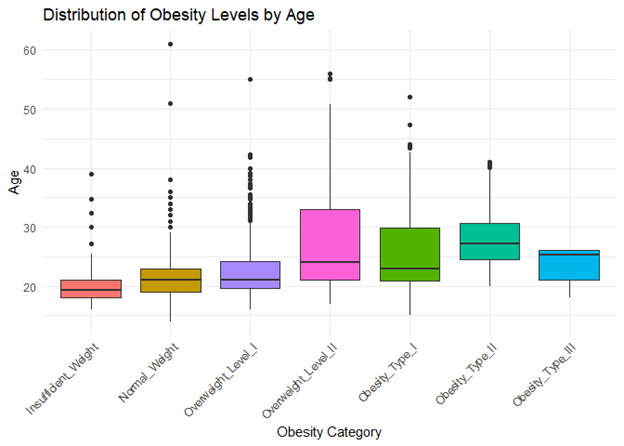

# Relationship between obesity and behavioral health features - a multi-class classification model to detect obesity based on survey data

This project studies the relationship between different lifestyle habits and behaviors, and obesity. For this purpose, I have analyzed the obesity dataset from UC Irvine Machine Learning Repository that has data on obesity levels in individuals from Mexico, Peru and Colombia, along with their eating habits and physical conditions.
The response variable Obesity Level is a multi-class categorical variable with seven levels: Insufficient Weight, Normal Weight, Overweight I, Overweight II, Obesity I, Obesity II and Obesity III. The task at hand is to predict these classes based on feature variables in the data. This is a multinomial classification problem. For this purpose, I have applied and studied the performance of Random Forest and Boosting techniques. I have also used Decision Tree and K-Nearest Neighbor Classification to study the accuracy of predication provided by each of these methods. 
All models are optimized via hyperparameter tuning. After collecting robust results from each of these methods, I evaluate and compare each model to determine which model performs best.

