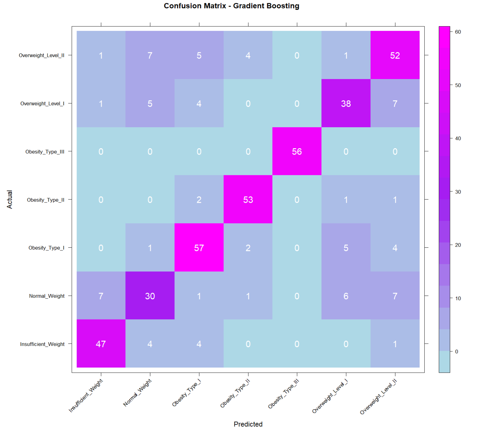

# Relationship between obesity and behavioral health features - a multi-class classification model to detect obesity based on survey data

This project studies the relationship between different lifestyle habits and behaviors, and obesity. For this purpose, I have analyzed the obesity dataset from UC Irvine Machine Learning Repository that has data on obesity levels in individuals from Mexico, Peru and Colombia, along with their eating habits and physical conditions. The dataset can be accessed here: .

The response variable Obesity Level is a multi-class categorical variable with seven levels: Insufficient Weight, Normal Weight, Overweight I, Overweight II, Obesity I, Obesity II and Obesity III, in the order of progressively increasing Body Mass Index (BMI). The task at hand is to predict these classes based on feature variables in the data. This is a multinomial classification problem. For this purpose, I have applied and studied the performance of Random Forest and Boosting techniques combined with feature selection to find a final robust and high performing classifier. 

## Exploratory Data Analysis

The number of records across each category are fairly similar, showing that there is no class imbalance issue.

  

  

Based on the exploratory data analysis, age, height, gender, family history with overweight, number of meals per day (NCP), physical activity (FAF), mode of transportation used frequently (MTRANS), eating high caloric food (FAVC) and eating between meals (CAEC) all appear to have at least a moderate relationship with obesity levels. Comparatively, water intake, alcohol use, technology/screen use, smoking, monitoring calories and consumption of vegetables have a weak relationship with obesity levels. I therefore dropped them from my models.

## Methodology

The data was first split into train and test set using an 80:20 split. Using the training set, I applied two ensemble methods: random forest and boosting to predict the obesity level. 

### Random Forest:

Random forest is a machine learning algorithm that uses multiple decision trees, each trained on a different subset of data, to classify each observation. By using information from many trees instead of one, random forest minimizes variance, and increases the robustness of the prediction, using majority vote of different decision trees on each observation. To apply random forest in R, I have used the RandomForest package. The number of trees I have used is 500.

### Boosting:

Boosting is a machine learning technique that involves combining the predictive power of weak learner classifiers to reduce the overall error rate of prediction. Boosting achieves this by taking the errors from one weak learner and training a different weak learner on data where the misclassified observations are given more weight. In this manner, the multiple weak learners train on the errors from other learners, resulting in overall reduced error. 

## Results

  

  

## Key Takeaways
