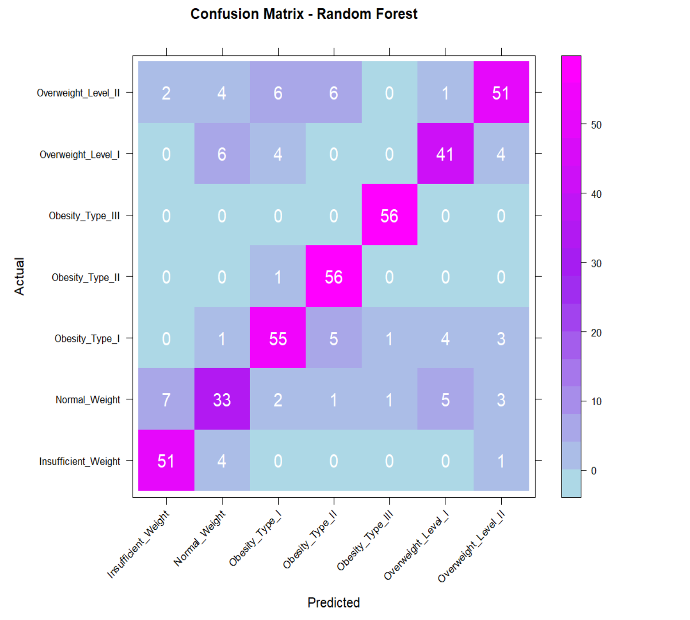
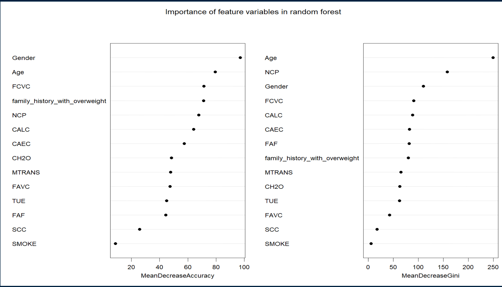

# Relationship between obesity and behavioral health features - a multi-class classification model to detect obesity based on survey data

This project studies the relationship between different lifestyle habits and behaviors, and obesity. For this purpose, I have analyzed the obesity dataset from UC Irvine Machine Learning Repository that has data on obesity levels in individuals from Mexico, Peru and Colombia, along with their eating habits and physical conditions. The dataset can be accessed here: [Estimation of Obesity Levels](https://archive.ics.uci.edu/dataset/544/estimation+of+obesity+levels+based+on+eating+habits+and+physical+condition).

The response variable Obesity Level is a multi-class categorical variable with seven levels based on the Body Mass Index: Insufficient Weight, Normal Weight, Overweight I, Overweight II, Obesity I, Obesity II and Obesity III, in the order of progressively increasing Body Mass Index (BMI). The task at hand is to predict these classes based on feature variables in the data. This is a multinomial classification problem. For this purpose, I have applied and studied the performance of Random Forest and Boosting techniques combined with feature selection to find a final robust and high performing classifier. 

## Exploratory Data Analysis

Per the original paper for this dataset, 77% of the data is synthetically generated to remove class imbalance, and 23% of the data was collected by means of a survey. We can see here that all class of the response variable are represented pretty much equally here, showing no presence of class imbalance: 

The following two charts show the relationship of the obesity levels class with age and physical activity. Other features including height, smoking, eating frequency between meals, caloric intake were also studied, and can be accessed in the Github repository for this project under the Images section. 

  

  

Based on the exploratory data analysis, weight, age, height, gender, family history with overweight, number of meals per day (NCP), physical activity (FAF), mode of transportation used frequently (MTRANS), eating high caloric food (FAVC) and eating between meals (CAEC) all appear to have at least a moderate relationship with obesity levels. Comparatively, water intake, alcohol use, technology/screen use, smoking, monitoring calories and consumption of vegetables have a weak relationship with obesity levels. I therefore dropped them from my models.

Since the class variables are based on body mass index (BMI), which itself is derived from weight and height measurements, I have removed those two features from the model.

## Methodology

The data was first split into train and test set using an 80:20 split. Using the training set, I have applied two ensemble methods: random forest and boosting to predict the obesity levels using the selected features, that I then evaluate based on the performance on test set. 

### Random Forest:

Random forest is a machine learning algorithm that uses multiple decision trees, each trained on a different subset of data, to classify each observation. By using information from many trees instead of one, random forest minimizes variance, and increases the robustness of the prediction, using majority vote of different decision trees on each observation. To apply random forest in R, I have used the RandomForest package. The number of trees I have used is 500.

### Boosting:

Boosting is a machine learning technique that involves combining the predictive power of weak learner classifiers to reduce the overall error rate of prediction. Boosting achieves this by taking the errors from one weak learner and training a different weak learner on data where the misclassified observations are given more weight. In this manner, the multiple weak learners train on the errors from other learners, resulting in overall reduced error. 

## Results

Random Forest classifier has an accuracy of 87.02% on the training set, and 82.89% on the test set. If we look at the test confusion matrix below, we can see that the model performs very well for Obesity levels Types II and III and Insufficient Weight. It has some trouble classifying other levels, especially normal weight that has a class accuracy of 79.6% and a precision of only 68.75%. Overweight levels I and II, and obesity level I have class accuracy of 86.0%, 84.8% and 88.70% respectively. This goes to show that given the behavioral and physical features selected, the model can pretty accurately distinguish between extreme cases of BMI (being obese or underweight). However, it doesn't perform as well on relatively mid-range values. A lot of misclassifications are in adjacent categories, for example, most of overweight Level I misclassification is either as normal weight or obesity level I, showing that the model does come close to categorizing to a relatively closer BMI level, rather than misclassifying to a completely different level of weight. None of the records with obesity Type I, II or III are misclassified as insufficient weight.

  

When we look at gradient boosting, we see a training accuracy of 96.17% and a test accuracy of 80.24%, suggesting a classic case of model overfitting to the training data. Looking at the confusion matrix below, we can see performance similar to random forest for most all categories, albeit slightly lower in terms of accuracy. Obesity types II And III have high class accuracies at 95.5% and 100% respectively. One key difference from the classification of random forest is that the misclassification is more random: There are 4 instances of insufficient weight that Gradient Boosting is classifying as Obesity Type I, as compared to 0 in the random forest outcome. 

  

The feature importance plot for random forest indicates that overall, age, gender, number of meals eaten in a day (NCP), vegetable consumption in meals (FCVC), drinking alcohol (CALC), and eating between meals play a significant role in explaining the obesity level of a person. While age and gender are physical features, the rest are behavioral factors that are linked to obesity. Smoking and monitoring calories (SCC) both have a very small impact on obesity levels.

  

We can hypothesize that since the data is based on survey and the answers are self-reported, data pertaining to behavioral factors may not be as reliable compared to the physical characteristics (age, height and gender). This may be contributing to poor performance of these features in determining obesity across the board. 

Another thing to note is that there are several classes of response variables in this problem - some behavioral variables may be effective in distinguishing between broader classes, but not as effective in determining the differences across all 5 classes. For example, we saw in exploratory data analysis earlier that people who are normal weight are highly represented in category of people exercising 4 to 5 days a week. However, both overweight classes are represented in all physical activity levels, so the model may not use this feature to determine those classes in particular.

## Key Takeaways

Overall, random forest model had a slgiht higher overall performance compared to gradient boosting in classifying obesity level on the given data, using physical and behavioral features. Also, given the high overfitting of the gradient boosting model to the training data, it is not the best choice for using on new observations.

We can conduct more research using slightly different methods to determine the impact of behavioral features as well:

1. Merge the seven classes into 3 or 4 broad categories: insufficient weight, normal weight, overweight and obese. By eliminating the need to capture variation between different overweight and obesity classes, this may help the model pick up the variation between the broader categories.
2. We can complement this study with models on based on non-survey data, for example, data obtained through fitness trackers and food recording apps may give a more accurate picture of a person's day-to-day behaviors and may reduce bias that comes from self-reporting these values.
3. Going to do more feature analysis to understand the impact of the behavorial variables and their statistical significance.

